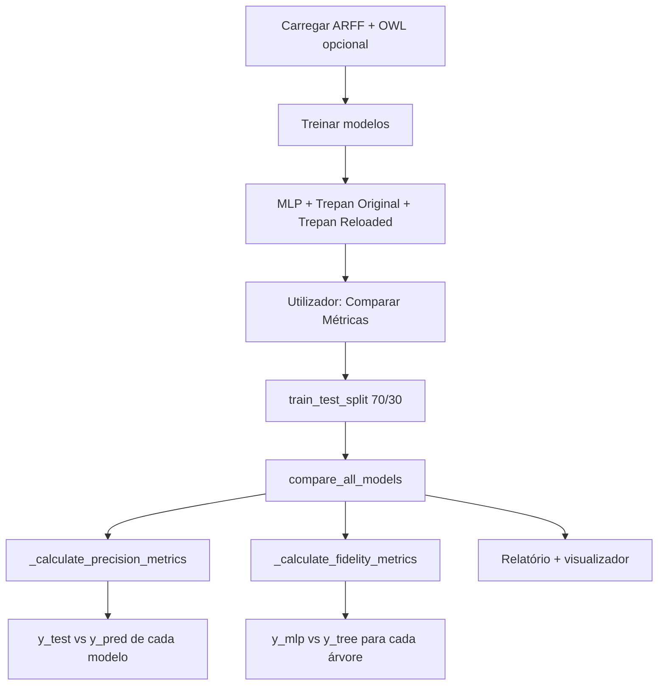

# Cálculo de precisão e fidelidade — Trepa Reloaded e outros modelos

Este documento descreve **como** o projeto calcula **precisão** e **fidelidade** para o oráculo MLP, Trepan-Original, Trepan-Reloaded e C4.5-Nativo. Para o papel da ontologia no enriquecimento de dados, ver também [`ENRIQUECIMENTO_ONTOLOGIA_FIDELIDADE_PRECISAO.md`](ENRIQUECIMENTO_ONTOLOGIA_FIDELIDADE_PRECISAO.md).

---

## Resumo em uma frase

| Métrica | Pergunta que responde | Referência (`y_true` na métrica) |
|---------|----------------------|----------------------------------|
| **Fidelidade** | A árvore **imita o MLP**? | Predições do **MLP** |
| **Precisão** | A árvore (ou MLP) **acerta o rótulo real**? | Rótulos verdadeiros do **test set** |

São conceitos distintos: uma árvore pode ser **fiel** ao MLP e ainda assim ter **baixa precisão** se o MLP errar face ao ground truth (e o inverso também).

---

## Onde os cálculos acontecem

Existem **dois níveis** de medição:

```
┌─────────────────────────────────────────────────────────────────────────┐
│ 1. DURANTE A EXTRAÇÃO DA ÁRVORE (interno ao extrator)                   │
│    • trepan_extractor.py / trepan_reloaded_extractor.py                 │
│    • Usado para relatórios, refinamento e escolha de candidatos       │
│    • Sem bootstrap (valores pontuais)                                   │
└─────────────────────────────────────────────────────────────────────────┘
                                    │
                                    ▼
┌─────────────────────────────────────────────────────────────────────────┐
│ 2. COMPARAÇÃO FORMAL (GUI → Comparar Métricas)                        │
│    • metrics_comparator.py → compare_all_models()                       │
│    • Hold-out 30%, random_state=42, bootstrap 1000×, IC 95%           │
└─────────────────────────────────────────────────────────────────────────┘
```

**Entrada da comparação formal:** `gui/biuri_app_complete.py` → `compare_metrics()` → `MetricsComparator.compare_all_models()`.

---

## Conjunto de dados e oráculo

### Divisão treino / teste (comparação formal)

- `train_test_split(test_size=0.3, random_state=42)`
- Estratificação por classe quando possível; caso contrário, divisão aleatória
- Métricas calculadas **apenas no teste** (30%)

### Qual MLP é referência para fidelidade?

Na comparação formal, **todas** as árvores (Original, Reloaded, C4.5) medem fidelidade face ao **MLP original** no `X_test` **original** (features ARFF, sem colunas `onto_*`):

```python
y_mlp_pred = mlp_model.predict(X_test)  # MLP original
overall_fidelity = accuracy_score(y_mlp_pred, y_tree_pred)
```

Para **Trepan-Reloaded**:

- **Predição da árvore:** `X_test` enriquecido (`X_test_reloaded`) + `apply_ontology_split_bias` (mesma transformação do treino)
- **Predição do MLP de referência:** continua a ser o MLP **original** no espaço original (`fidelity_reference: 'mlp_original'`)

### Pipeline dual (com ontologia)

Quando há ontologia e dados aumentados (`X_encoded_aug`):

| Modelo | Espaço de `X` no teste | Precisão vs `y_test` | Fidelidade vs MLP |
|--------|------------------------|----------------------|-------------------|
| MLP original | `X_test_encoded` | Sim | N/A (é a referência) |
| Trepan-Original | `X_test_encoded` | Sim | `y_mlp` original |
| Trepan-Reloaded | `X_test_encoded_aug` + bias | Sim | `y_mlp` original |
| C4.5-Nativo | `X_test_encoded` (só ARFF) | Sim | `y_mlp` original |

C4.5 é **re-treinado** no hold-out de treino dentro de `compare_all_models()` para evitar vazamento.

---

## Fidelidade

### Definição (TREPAN clássico)

**Fidelidade** = grau em que a árvore explicativa reproduz as **predições do MLP**, não a exactidão face aos rótulos verdadeiros.

```
Fidelidade global = accuracy_score(y_mlp_pred, y_tree_pred)
                  = (nº amostras em que árvore == MLP) / nº amostras
```

Equivalente a `agreement_rate = mean(y_mlp_pred == y_tree_pred)`.

Implementação base (Reloaded, com bias ontológico nas features da árvore):

```python
# core/trepan_reloaded_extractor.py — _calculate_fidelity
X_tree = self.apply_ontology_split_bias(X_data)
y_tree_pred = tree.predict(X_tree)
y_mlp_pred = mlp_model.predict(self._features_for_mlp_oracle(X_data))
fidelity = accuracy_score(y_mlp_pred, y_tree_pred)
```

Trepan-Original usa o mesmo princípio, sem `apply_ontology_split_bias` nem `_features_for_mlp_oracle`:

```python
# core/trepan_extractor.py — _calculate_fidelity
y_tree_pred = tree.predict(X_data)
y_mlp_pred = mlp_model.predict(X_data)
fidelity = accuracy_score(y_mlp_pred, y_tree_pred)
```

---

### Fidelidade durante a extração

#### Trepan-Original (`trepan_extractor.py`)

| Métrica | Dados | Cálculo |
|---------|-------|---------|
| Fidelidade sintética | Amostras geradas para destilação | `accuracy(y_mlp, y_tree)` |
| Fidelidade real | `X_encoded` de validação | `accuracy(y_mlp, y_tree)` |
| Relatório | Média `(sintético + real) / 2` | Classificação textual (>0.9 excelente, …) |

Métricas extra em `_calculate_fidelity_metrics` (análise interna):

- Fidelidade **por classe**
- Fidelidade quando `max(predict_proba) > 0.8` (alta confiança do MLP)

#### Trepan-Reloaded (`trepan_reloaded_extractor.py`)

**Método:** `_calculate_ontology_aware_fidelity`

| Campo | Significado |
|-------|-------------|
| `overall_real` | Fidelidade em dados reais |
| `overall_synthetic` | Fidelidade em dados sintéticos ontologia-aware |
| `semantic_groups` | Fidelidade aproximada por grupo semântico de features |

**Fidelidade por grupo semântico** (`_calculate_semantic_group_fidelity`):

1. Agrupa índices de features por `semantic_group`
2. Treina árvore temporária (`max_depth=3`) só com esse subconjunto
3. Compara com o MLP que usa **todas** as features → valor **aproximado**

**Refinamento de árvore:** `_measure_tree_performance` devolve fidelidade e precisão num único passo:

```python
{
    'fidelity': accuracy_score(y_mlp, y_tree),
    'precision': precision_score(y_true, y_tree, average='weighted', zero_division=0),
}
```

- `_fidelity_boost_refinement`: maximiza fidelidade sem baixar um **piso** de fidelidade
- `_precision_boost_refinement`: maximiza precisão sem violar piso de fidelidade; compara com Trepan-Original e C4.5

---

### Fidelidade na comparação formal

**Ficheiro:** `core/metrics_comparator.py` — `_calculate_fidelity_metrics`

Para cada árvore (Original, Reloaded, C4.5):

| Métrica | Função | Papel de `y_mlp_pred` |
|---------|--------|------------------------|
| `overall_fidelity` | `accuracy_score(y_mlp, y_tree)` | Ambos são predições; mede concordância |
| `precision_fidelity` | `precision_score(y_mlp, y_tree, average='weighted')` | `y_mlp` actua como **rótulo de referência** |
| `recall_fidelity` | `recall_score(..., weighted)` | Idem |
| `f1_fidelity` | `f1_score(..., weighted)` | Idem |
| `agreement_rate` | `mean(y_mlp == y_tree)` | Igual à fidelidade global |

**Distinção importante:** em `precision_fidelity`, o sklearn trata `y_mlp_pred` como `y_true` e `y_tree_pred` como `y_pred` — mede qualidade da imitação **por classe**, ponderada pelo suporte das classes previstas pelo MLP.

#### Intervalos de confiança (bootstrap)

**Método:** `_bootstrap_confidence_interval`

- 1000 reamostragens com reposição (`n_bootstrap=1000`, `random_state=42`)
- IC 95%: percentis 2.5 e 97.5 das métricas bootstrap
- Aplicado a `overall_fidelity` e `precision_fidelity` (com IC); recall/F1 sem IC na estrutura principal

#### Análises granulares (fidelidade)

| Análise | Método | Critério principal |
|---------|--------|-------------------|
| Por confiança do MLP | `_analyze_fidelity_by_confidence_region` | Alta: `max_proba > 0.7` |
| Por tipo de erro | `_analyze_fidelity_by_error_type` | Cruza discordância MLP–árvore com erro vs `y_test` |
| Por região de features | `_analyze_fidelity_by_feature_region` | Subespaços de features |
| Discrepâncias | `_analyze_discrepancies` | Casos MLP ≠ árvore com contexto de features |

*(Trepan-Original na extração usa limiar 0.8 para alta confiança; o comparador formal usa 0.7.)*

---

## Precisão

### Definição neste projeto

**Precisão** = métrica de classificação sklearn face aos **rótulos verdadeiros** do conjunto de teste (`y_test`), **não** face ao MLP.

```python
precision = precision_score(y_test, y_pred, average='weighted', zero_division=0)
```

Também se calculam no mesmo bloco:

- `accuracy` → `accuracy_score(y_test, y_pred)`
- `recall` → `recall_score(..., average='weighted')`
- `f1` → `f1_score(..., average='weighted')`

Internamente existem variantes **macro** (`precision_macro`, etc.) via `_calculate_metrics_with_ci(..., include_macro=True)`.

**Não confundir** com `precision_fidelity`, que mede concordância árvore–MLP.

---

### Precisão na comparação formal

**Método:** `_calculate_precision_metrics` → `_calculate_metrics_with_ci(y_test, y_pred)`

Modelos avaliados:

| Chave | Modelo | `y_pred` obtido de |
|-------|--------|-------------------|
| `mlp` | MLP original | `mlp_model.predict(X_test)` |
| `trepan_original` | Trepan-Original | `trepan_original_tree.predict(X_test)` |
| `trepan_reloaded` | Trepan-Reloaded | `trepan_reloaded_tree.predict(X_rel)` com `X_rel` enriquecido + bias |
| `c45_j48` | C4.5-Nativo (chave interna legada) | `c45_tree.predict(X_test)` |

Todas as métricas acima incluem **IC 95%** por bootstrap (mesmo procedimento da fidelidade).

**Métricas adicionais** (`_calculate_additional_metrics`): matriz de confusão, Cohen's Kappa, AUC-ROC multiclasse, log loss, Brier score, avisos de desbalanceamento (`_detect_class_imbalance`, classes &lt; 5%).

---

### Precisão durante a extração (Reloaded)

Em `_measure_tree_performance` e fases de refinamento (`_precision_boost_refinement`, `_score_tree_dominance`):

```python
precision = precision_score(y_true, y_tree, average='weighted', zero_division=0)
```

Usada para **escolher** candidatos de árvore que superem Trepan-Original e C4.5 em fidelidade **e** precisão (`_tree_dominates`), não para o relatório formal da GUI.

---

### Precisão rápida após treino (GUI)

**Método:** `train_model()` em `biuri_app_complete.py`

Após treinar o MLP, mostra **acurácia** no conjunto completo (sem hold-out nem bootstrap):

```python
accuracy = accuracy_score(y_true_labels, y_pred_labels)
```

É indicador imediato; a comparação rigorosa usa `compare_metrics()`.

---

### Precisão no treino C4.5 (`c45_j48_tree.py`)

No treino local da árvore C4.5, guarda métricas no **conjunto de treino** (informativo):

```python
'train_precision': precision_score(y_train, y_train_pred, average='weighted', zero_division=0)
```

A comparação entre modelos usa o C4.5 re-treinado no split de treino do comparador e avalia no **teste**.

---

## Fluxo na aplicação



---

## Tabela comparativa final

| Aspecto | Precisão | Fidelidade |
|---------|----------|------------|
| **Referência** | `y_test` (rótulos reais) | `y_mlp_pred` (MLP original) |
| **Pergunta** | “Acerta a classe verdadeira?” | “Concorda com o MLP?” |
| **MLP** | Avaliado | Referência (não tem fidelidade) |
| **Árvores** | Avaliadas | Avaliadas |
| **Média sklearn** | `weighted` | `weighted` em precision/recall/F1 de fidelidade |
| **Bootstrap IC 95%** | Sim (accuracy, precision, recall, f1) | Sim (overall + precision_fidelity) |
| **Durante extração** | Reloaded (refinamento) | Original + Reloaded |
| **C4.5 treina em** | Labels reais `y` | — |
| **Trepan treina para imitar** | — | Oráculo MLP (sintéticos + destilação) |

---

## Parâmetros fixos relevantes

| Parâmetro | Valor | Local |
|-----------|-------|-------|
| `test_size` | 0.3 | GUI + comparador |
| `random_state` | 42 | splits e bootstrap |
| `n_bootstrap` | 1000 | `MetricsComparator.__init__` |
| IC | 95% | percentis 2.5 / 97.5 |
| `zero_division` | 0 | todas as `precision_score` / `recall_score` |
| Alta confiança MLP (comparador) | `max_proba > 0.7` | `_analyze_fidelity_by_confidence_region` |
| Alta confiança MLP (Original, extração) | `max_proba > 0.8` | `trepan_extractor.py` |

---

## Ficheiros de referência

| Ficheiro | Responsabilidade |
|----------|------------------|
| `core/metrics_comparator.py` | Precisão e fidelidade formais, bootstrap, relatórios, testes estatísticos |
| `core/trepan_reloaded_extractor.py` | Fidelidade/precisão na extração, refinamento, grupos semânticos |
| `core/trepan_extractor.py` | Fidelidade Trepan-Original na extração |
| `core/c45_j48_tree.py` | Baseline C4.5; métricas de treino locais |
| `gui/biuri_app_complete.py` | `compare_metrics()`, splits, pipeline dual com ontologia |

---

## Exemplo conceptual

Num teste com 100 amostras:

- MLP e ground truth concordam em 90; árvore concorda com MLP em 85 e com ground truth em 80.

Então:

- **Fidelidade** ≈ 85% (85/100 acertos vs MLP)
- **Precisão (accuracy)** ≈ 80% (80/100 acertos vs rótulos reais)

A árvore pode ser **mais fiel que precisa** se imita sistematicamente erros do MLP.

---

*Documento gerado com base no código em `core/metrics_comparator.py`, `core/trepan_reloaded_extractor.py`, `core/trepan_extractor.py` e `gui/biuri_app_complete.py`.*

## Nota de auditoria V9.1 — terminologia e duas referências de fidelidade

Na interface e nos gráficos, **Accuracy / Exatidão** é a proporção total de
acertos contra `y_test`. Ela não deve ser rotulada como **Precision / Precisão**.
A métrica `precision_score` continua disponível quando é realmente calculada,
mas é uma métrica diferente.

Para o TREPAN Reloaded são reportadas separadamente:

- `fidelity_to_active_oracle`: concordância com o professor efetivamente usado
  na extração (ontológico/híbrido ou fallback);
- `fidelity_to_mlp_original`: concordância de controlo com o MLP Original, que
  permite uma comparação causalmente mais limpa com o TREPAN Original.

O C4.5-Nativo é um **baseline supervisionado pelos rótulos reais**. Não substitui
o MLP como oráculo TREPAN; qualquer fidelidade/concordância ao C4.5 tem papel
apenas auxiliar.
