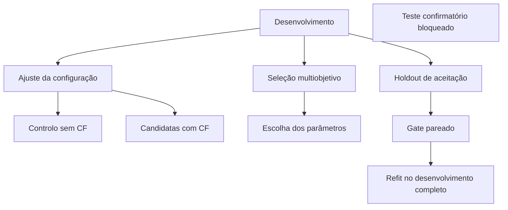

# Melhoria da árvore substituta com contrafactuais — V9

## Objetivo

Esta versão integra no BIURI a opção **Melhorar árvore substituta**, descrita na
tese de Eldis Dennys González Pérez e no projeto de referência recebido. A
operação usa contrafactuais para reextrair uma candidata que represente melhor
o professor MLP em regiões próximas da fronteira, sem aceitar degradação do
desempenho contra os rótulos reais.

A funcionalidade aplica-se somente a:

- **TREPAN Original**, no espaço ARFF original e com o MLP Original;
- **TREPAN Reloaded**, no espaço e com o professor ontológico ativo, mas apenas
  quando a OWL passou os quality gates.

O **C4.5-Nativo não é alterado**: ele é um baseline supervisionado diretamente
pelos rótulos reais, não uma árvore substituta do MLP.

## Distinção entre as duas árvores contrafactuais da interface

| Opção | Produto | Finalidade |
|---|---|---|
| Construir árvore CF | Nova árvore local, treinada para explicar um conjunto de factuais e CFs | Exploração de regras contrafactuais |
| Melhorar árvore substituta | Nova versão candidata do TREPAN Original ou Reloaded | Melhorar fidelidade e desempenho real sem perder interpretabilidade |

Cada modelo-alvo conserva o seu próprio estado. Uma árvore CF ou uma árvore
melhorada nunca é reutilizada como se pertencesse aos três modelos.

## Correspondência entre a tese e o BIURI

| Elemento metodológico da tese (pp. 39–44) | Implementação V9 | Reforço científico aplicado |
|---|---|---|
| Seleção estratificada de factuais | Amostragem por classe no subtreino | Limite configurável e origem auditada |
| Geração CLEAR/COGS | Motor unificado do BIURI | Um lote próprio por professor e feature space |
| Validade no MLP e confiança mínima | Mudança de classe + `predict_proba` ≥ 0,60 | Classes de probabilidade alinhadas explicitamente |
| Categorias A, B e C | Coincidente, divergente e gap | Contagens e seleção por política A+B ou A+B+C |
| Peso por tipo | A=1, B=2, C=0,30 | Multiplicado também por confiança, densidade e fronteira |
| Densidade por classe | Percentil 95 da distância ao vizinho real | CF fora do limiar é rejeitado, não apenas atenuado |
| Ênfase de fronteira | Incerteza da folha da árvore controlo | Calculada no substituto pareado |
| Peso agregado dos CFs | Grelha de 3% ou 5% do orçamento sintético | Teto global e peso individual máximo |
| Âncoras reais | 20% do subtreino, por omissão | Peso unitário e sem acesso ao teste |
| `extra_X`, `extra_y`, `extra_weights` | Suportados pelos dois extratores TREPAN | Propagação corrigida em todos os feature spaces do Reloaded |
| Reextração do zero | Novo extrator por candidata | A árvore original nunca é alterada in-place |
| Seleção por validação cruzada | Ajuste + seleção + auditoria interna | O gate não reutiliza o holdout que escolheu os parâmetros |

## Protocolo de dados

O teste externo não é colocado em `improvement_contexts`; portanto, o worker
não o consegue usar por acidente. A árvore final aprovada é reajustada em todo
o desenvolvimento, mas não é avaliada pelo botão.

### Comparação causal pareada

Para cada etapa são treinadas duas reextrações com a mesma semente e os mesmos
limites:

1. controlo, sem os CFs desta funcionalidade;
2. candidata, com os CFs filtrados e ponderados.

A diferença observada pode assim ser atribuída ao lote contrafactual, não a uma
amostra sintética aleatória mais favorável. No Reloaded, o lote automático de
CFs anterior é desligado igualmente nos dois braços; os restantes componentes
do Reloaded permanecem iguais.

## Quality gate de aceitação

A candidata só substitui a árvore existente quando todas as condições passam
no holdout de aceitação, que não participou na escolha dos parâmetros:

- ganho mínimo em accuracy, balanced accuracy ou macro-F1 contra rótulos reais;
- balanced accuracy e macro-F1 não inferiores ao controlo pareado;
- recall da classe mais fraca dentro da tolerância;
- fidelidade ao professor não inferior;
- ganho atribuível à presença dos CFs;
- complexidade abaixo do limite relativo de nós.

Se qualquer condição falhar, o estado é `rejected_by_quality_gate` e a árvore
já existente é mantida. Ausência de CFs válidos produz
`rejected_no_valid_counterfactuals`.

## Separação Original × Reloaded

| Campo | TREPAN Original | TREPAN Reloaded |
|---|---|---|
| Professor | MLP Original | Professor ontológico aceite |
| Matriz | Features ARFF codificadas | Feature space enriquecido/ativo |
| Nomes | Schema original | Schema exato do oráculo Reloaded |
| Validação OWL dos CFs | Não aplicável | Ativa quando há OWL aceite |
| Sem OWL aceite | Executado normalmente | Espelha o resultado Original |

Não há truncagem, preenchimento com zero ou adaptação posicional de features.
Uma incompatibilidade de dimensionalidade interrompe a operação com erro.

## Utilização na interface

1. Carregar o ARFF e, se aplicável, uma OWL de domínio.
2. Treinar os modelos.
3. Abrir a área de contrafactuais e escolher **Melhorar árvore substituta**.
4. Selecionar Original, Reloaded ou ambos; escolher COGS, CLEAR ou combinação.
5. Executar o experimento.
6. Consultar `atual*`, `sem CF` e `com CF`, os tipos A/B/C e os blockers.
7. Visualizar apenas as árvores cuja candidata passou no quality gate.

O asterisco da árvore atual indica uma métrica meramente descritiva: a árvore
pré-existente pode ter sido ajustada com todo o desenvolvimento. A decisão usa
o par independente `sem CF` × `com CF`.

## Auditoria devolvida

O resultado inclui:

- tamanhos de ajuste, seleção, aceitação e refit;
- parâmetros escolhidos e tabela de candidatas;
- métricas do controlo e da candidata;
- deltas do gate e blockers;
- quantidade de CFs A/B/C, duplicados e rejeitados;
- auditoria dos extratores;
- `test_used_for_selection=False`;
- `locked_test_used=False`;
- `final_test_evaluated=False`;
- `prior_interactive_cf_reused=False`.

## Limites da conclusão

Uma candidata aprovada demonstra ganho **interno de desenvolvimento** sobre uma
reextração pareada. Isso não prova, por si só, superioridade confirmatória sobre
TREPAN Original ou C4.5. Essa afirmação exige a execução única do benchmark
confirmatório bloqueado, com datasets e ontologias independentes previamente
definidos.

O método também não pode ultrapassar sistematicamente o desempenho real do
professor apenas por aumentar fidelidade. As âncoras com rótulos reais tornam a
reextração híbrida e permitem procurar ganho preditivo, mas o quality gate
rejeita esse componente quando ele degrada generalização, minoria ou
complexidade.

## Ficheiros principais

- `counterfactuals/surrogate_improvement.py`: protocolo, A/B/C, pesos, busca e gate;
- `counterfactuals/service.py`: separação dos modelos, builders e auditoria;
- `core/trepan_extractor.py`: injeção ponderada no Original;
- `core/trepan_reloaded_extractor.py`: injeção ponderada no Reloaded;
- `core/plausible_counterfactuals.py`: desativação real do lote automático no controlo;
- `gui/surrogate_improvement_dialog.py`: opções da experiência;
- `gui/biuri_app_complete.py`: sessão sem teste, resultados e visualização;
- `tests/test_surrogate_improvement_v9.py`: regressões científicas da funcionalidade.
